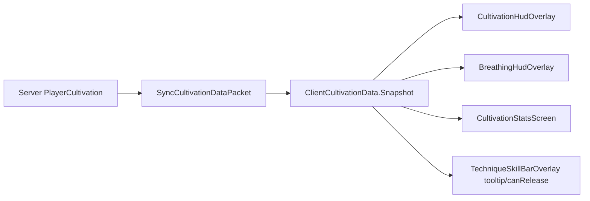
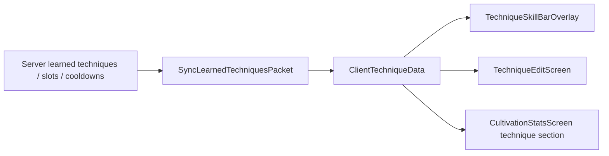
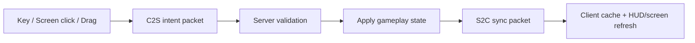

# 前端 / 客户端重构交接文档

> 用途：把当前“寻仙问道”客户端 UI、HUD、输入、客户端缓存和网络边界单独列出，方便交给其他 AI 或开发者做前端重构。  
> 当前基线：Minecraft 1.20.1 + Forge 47.2.0，`mod_version=0.1.80`，`ModNetwork.PROTOCOL_VERSION=7`。  
> 本文只描述客户端/前端边界，不把服务端玩法结算迁入客户端。

## 1. 重构范围

前端可重构范围：

- `src/main/java/com/xunxian/seekingimmortals/client/`
- `src/main/resources/assets/seeking_immortals/textures/gui/`
- `src/main/resources/assets/seeking_immortals/lang/zh_cn.json`
- `src/main/resources/assets/seeking_immortals/lang/en_us.json`
- 与 UI 展示直接相关的 item/block model、texture、tooltip 文案
- 网络包中的客户端同步入口和客户端意图入口，但只允许在明确理解协议后改字段

前端相邻但要谨慎的范围：

- `src/main/java/com/xunxian/seekingimmortals/network/SyncCultivationDataPacket.java`
- `src/main/java/com/xunxian/seekingimmortals/network/SyncLearnedTechniquesPacket.java`
- `src/main/java/com/xunxian/seekingimmortals/network/ReleaseTechniquePacket.java`
- `src/main/java/com/xunxian/seekingimmortals/network/SetTechniqueSlotPacket.java`
- `src/main/java/com/xunxian/seekingimmortals/network/SetMeditatingPacket.java`
- `src/main/java/com/xunxian/seekingimmortals/network/AttemptBreakthroughPacket.java`

这些 packet 是 UI 和服务端权威逻辑之间的边界。改 packet 字段、顺序、编码/解码格式或不兼容通道行为时，必须同时 bump `ModNetwork.PROTOCOL_VERSION`。

## 2. 不要跨越的边界

- 不要把服务端玩法结算搬到客户端。
- 不要信任客户端传来的灵力消耗、冷却、槽位、技能 ID、境界或修为数值。
- 不要从 common/server 初始化路径直接引用 `client` 包类。
- 客户端类必须保持在 `Dist.CLIENT` 隔离下。
- 客户端可以预测展示 pending 状态，但最终状态必须以服务端同步包为准。
- 不要重新引入第三方 UI 框架，除非用户明确要求。
- 如果只做 UI 外观重构，尽量不要改 packet 协议。

## 3. 客户端文件清单

| 文件 | 角色 | 主要依赖 | Packet 边界 | 重构风险 | 备注 |
| --- | --- | --- | --- | --- | --- |
| `client/ClientEvents.java` | 客户端事件入口、按键注册、HUD 注册、背包按钮注入、同步状态重置 | Forge client events、`Minecraft`、`KeyMapping`、`ClientCultivationData`、`ClientTechniqueData` | 发送 `SetMeditatingPacket`、`AttemptBreakthroughPacket`、`ReleaseTechniquePacket`；打开 `TechniqueEditScreen` / `CultivationStatsScreen` | 高 | 必须保持 `Dist.CLIENT`；背包按钮只注入原版 `InventoryScreen`；任意 Screen 打开时会 drain 技能按键 |
| `client/CultivationStatsScreen.java` | 独立“修仙属性”面板 | `Screen`、`InventoryScreen`、`ImmortalUiSkin`、两个客户端数据镜像 | 发送 `AttemptBreakthroughPacket` | 中 | 单页分区展示基础状态、战斗属性、灵根、功法、负面状态；从背包进入时返回背包 |
| `client/TechniqueEditScreen.java` | 7 槽技能编辑器 | `Screen`、`ImmortalUiSkin`、`ClientTechniqueData` | 发送 `SetTechniqueSlotPacket` | 中 | 支持拖拽绑定、右键清空；当前布局较硬编码，适合重构 |
| `client/TechniqueSkillBarOverlay.java` | 左侧 7 槽技能 HUD | Forge overlay、`ClientTechniqueData`、`ClientCultivationData`、`ImmortalUiSkin` | 不直接发包；释放由按键入口触发 | 中 | 显示槽位、占位图标、tooltip、冷却；技能图标仍是占位逻辑 |
| `client/BreathingHudOverlay.java` | 打坐吐纳 HUD | Forge overlay、`ClientCultivationData`、`ImmortalUiSkin` | 不直接发包 | 低到中 | 使用 `cultivation_progress_bar.png` 显示 5 秒结算进度 |
| `client/CultivationHudOverlay.java` | 常驻修仙 HUD | Forge overlay、`ClientCultivationData` | 不直接发包 | 中 | 显示境界、修为进度、灵力、神识、走火风险；注意不要遮挡原版 HUD |
| `client/ImmortalUiSkin.java` | 原生 UI 绘制工具 | `GuiGraphics`、`ResourceLocation`、Minecraft font/render helpers | 无 | 中 | 适合抽离样式 token、颜色、面板、状态条、tooltip、技能槽绘制 |
| `client/ClientCultivationData.java` | 客户端修炼数据镜像 | `SyncCultivationDataPacket` | 接收 S2C 后更新 | 高 | 只做展示缓存；不要把它当权威数据源 |
| `client/ClientTechniqueData.java` | 客户端技能/槽位/冷却镜像和内置 tooltip 摘要 | `SyncLearnedTechniquesPacket`、内置 cultivation JSON | 接收 S2C 后更新 | 高 | 技能摘要从资源 JSON 读取；槽位顺序来自服务端同步 |
| `client/EmptyEntityRenderer.java` | 不可见辅助实体 renderer | Forge renderer | 无 | 低 | 当前用于蒲团座位和飞剑弹射物等不可见/占位渲染 |

## 4. 前端资源清单

| 路径 | 用途 | 状态 |
| --- | --- | --- |
| `assets/seeking_immortals/textures/gui/cultivation_progress_bar.png` | 打坐吐纳 5 秒结算进度条底图 | 正在使用 |
| `assets/seeking_immortals/textures/gui/skill_bar_frame.png` | 历史技能栏外框资源 | 保留但当前不绘制 |
| `assets/seeking_immortals/lang/zh_cn.json` | 中文 UI、按键、消息、本地化 | 前端重构时要同步维护 |
| `assets/seeking_immortals/lang/en_us.json` | 英文 UI、按键、消息、本地化 | 新增文案时尽量同步维护 |
| `assets/seeking_immortals/models/item/*.json` | 物品模型 | 图标/tooltip 重构时可能涉及 |
| `assets/seeking_immortals/textures/item/*.png` | 物品和功法卷轴贴图 | 大量功法卷轴仍有 placeholder |

## 5. 当前 UI 流程

### HUD 注册与渲染

`ClientEvents.registerGuiOverlays` 注册三个 overlay：

- `technique_skill_bar` -> `TechniqueSkillBarOverlay.renderOverlay`
- `breathing_hud` -> `BreathingHudOverlay.renderOverlay`
- `cultivation_hud` -> `CultivationHudOverlay.renderOverlay`

重构重点：

- 所有 HUD 都要在合适条件下隐藏，尤其是任意 Screen 打开时的表现。
- 需要测试 GUI Scale 1/2/3/Auto 和小窗口。
- 技能栏固定 7 槽，数量来自 `PlayerCultivation.TECHNIQUE_SLOT_COUNT == 7` 的设计约束。

### 按键与交互

- 打坐键默认 `V`：客户端切换 pending 状态并发送 `SetMeditatingPacket(boolean)`。
- 尝试突破键默认未绑定：发送 `AttemptBreakthroughPacket()`。
- 技能编辑键默认未绑定：打开 `TechniqueEditScreen`。
- 7 个技能释放键默认未绑定：客户端只发送槽位 `ReleaseTechniquePacket(slot)`；服务端验证槽位、已学状态、灵力、冷却和效果。
- 打开任意 Screen 时会 drain 技能相关按键，避免在 UI 中误释放技能。

### 背包入口

- `ClientEvents.onScreenInit` 只在 `event.getScreen().getClass() == InventoryScreen.class` 时注入“修仙”按钮。
- 点击后打开 `CultivationStatsScreen(player, true)`。
- 从该入口进入时，关闭/返回会重新打开原版 `InventoryScreen`。

### 技能编辑

- `TechniqueEditScreen` 左侧 7 个槽位，右侧已学技能列表。
- 从右侧拖拽到左侧槽位：发送 `SetTechniqueSlotPacket(slot, techniqueId)`。
- 右键槽位清空：发送 `SetTechniqueSlotPacket(slot, "")`。
- 左键槽位仍保留按同序号已学技能绑定的兼容行为。

## 6. 数据流

### 修炼数据同步



注意：

- `ClientCultivationData` 是客户端缓存，不是权威状态。
- 修为、灵力、神识、战斗属性、负面状态、灵根信息都以服务端同步为准。
- UI 可以根据缓存计算展示比例，但不能决定真正的消耗、冷却或成功率。

### 技能数据同步



注意：

- 技能 learned list、7 槽绑定和 cooldown 剩余 tick 来自服务端。
- `ClientTechniqueData.TechniqueSummary` 用于 tooltip 和列表显示，来源是内置 cultivation JSON 的客户端摘要。
- 0.1.54 新增筑基期 6 个技能后，前端仍使用通用占位图标/tooltip 展示方式。

### 客户端意图到服务端



服务端必须验证：

- 槽位范围 0-6
- 技能是否已学
- 灵力是否足够
- cooldown 是否结束
- 境界、灵根、技能效果是否允许
- 玩家 Capability 是否存在

## 7. 建议重构目标

优先级建议：

1. 把 UI 尺寸、颜色、边距、行高、槽位尺寸统一收敛到 `ImmortalUiSkin` 或独立的 client UI constants。
2. 把数据格式化逻辑从 `CultivationStatsScreen` 和 overlay render 方法中抽离，减少渲染函数内字符串拼接。
3. 给 `TechniqueEditScreen` 做响应式布局，减少固定 `PANEL_WIDTH`、`LEARNED_X_OFFSET`、`SLOT_START_Y_OFFSET` 的耦合。
4. 给 `TechniqueSkillBarOverlay` 增加正式技能图标映射，替换 hash/color/首字母占位逻辑。
5. 给 0.1.54 筑基技能补前端视觉状态：罡气护体护盾提示、御剑飞行进阶状态、五行遁术冷却/落点提示、北斗剑阵状态、阵法感知粒子说明。
6. 改善 tooltip 层级、冷却遮罩和不可释放原因展示，但仍以服务端失败提示为准。
7. 增加 HUD 安全区策略，避免和血条、饥饿、经验条、JEI/其他 mod UI 冲突。

## 8. 交给其他 AI 的任务切分建议

可以按以下顺序交付：

1. 只重构 `ImmortalUiSkin` 和 UI constants，不改功能。
2. 重构 `CultivationStatsScreen` 布局和文本格式化，不改 packet。
3. 重构 `TechniqueEditScreen` 拖拽/布局，不改 `SetTechniqueSlotPacket` 字段。
4. 重构 `TechniqueSkillBarOverlay` tooltip、冷却遮罩和技能图标映射。
5. 重构 HUD 安全区和 GUI Scale 适配。
6. 最后再考虑新增 packet 字段或协议变更；如需变更，先写协议变更说明并 bump `ModNetwork.PROTOCOL_VERSION`。

## 9. 验证清单

代码或资源改动后必须运行：

```powershell
.\gradlew.bat --no-daemon --max-workers=1 build
```

游戏内建议验证：

- 专用服务器启动不崩，确认没有 common/server 路径加载 client-only 类。
- GUI Scale 1、2、3、Auto 下，修仙属性页、技能编辑页、技能栏、打坐 HUD、常驻 HUD 不出屏、不重叠。
- 原版背包只出现一个“修仙”入口，且不会注入到非原版背包 Screen。
- 打开任意 Screen 时，技能快捷键不会误释放。
- 打坐键 `V` 能进入/退出 pending 状态，服务端同步后 HUD 状态正确。
- 7 个技能槽绑定、清空、重登、死亡/重生后同步正确。
- 技能释放失败时，以服务端提示为准，不只看客户端 canRelease。
- 0.1.54 筑基期 6 个技能在技能栏、编辑页、修仙面板中能正常显示名称、来源、属性、消耗、冷却。

## 10. 当前 caveats

- `skill_bar_frame.png` 是历史保留资源，当前不绘制。
- 技能图标仍偏占位，正式图标映射未完成。
- 没有专门的前端自动化测试；主要依赖 `gradlew build` 和游戏内回归。
- 部分中文源码字符串在非 UTF-8 终端中可能显示乱码；实际文件按 UTF-8 维护。
- 大量功法卷轴贴图仍有 placeholder，重构图标时不要误删占位资源。
- 0.1.54 已有筑基期技能服务端 MVP，但前端仍缺少独立视觉表现和状态提示。
